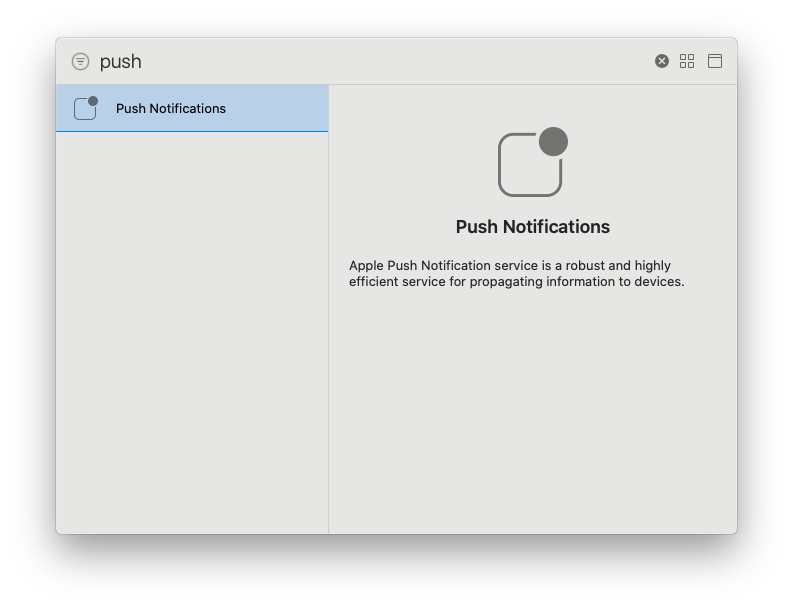
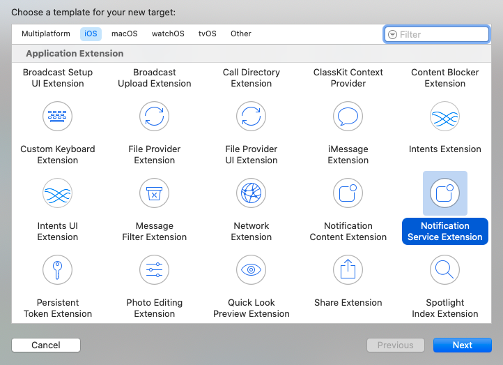

<p align="center" >

</p>

# MPush-Flutter


MPush client for Flutter, you can use this plugin to interact with the [MPush](https://mpush.cloud) platform.

- [Installation](#Installation)
- [Setup](#Setup)
	- [Android](#Android)
	- [iOS](#iOS)
- [Usage](#Usage)

# Installation

You can install the MBurger SDK using pub, add this to your `pubspec.yaml` file:

```yaml
dependencies:
  mpush: ^0.0.1
```

And then install packages from the command line with:

```
$ flutter pub get
```

# Setup

## Android

## iOS

The first thing you have to do is to setup the iOS project is to enable the push notification capability to your project. Open the project in Xcode going in ios -> Runner.xcworkspace, then in the Signing & Capabilities tab click on the + Capability button and select "Push Notifications"



> Note: you will have to use a provisoning profile created for this app, you will not be able to test and receive push notification using a wildcard provisioning profile.

Then yu have to modify the AppDelegate class of your application, open AppDelegate.swift file and add this line in the `didFinishLaunchingWithOptions` function.

``` swift
UNUserNotificationCenter.current().delegate = self
```
The app delegate should look like this.

``` swift
import UIKit
import Flutter

@UIApplicationMain
@objc class AppDelegate: FlutterAppDelegate {
  override func application(
    _ application: UIApplication,
    didFinishLaunchingWithOptions launchOptions: [UIApplication.LaunchOptionsKey: Any]?
  ) -> Bool {
    UNUserNotificationCenter.current().delegate = self
    GeneratedPluginRegistrant.register(with: self)
    return super.application(application, didFinishLaunchingWithOptions: launchOptions)
  }
}
```

### Rich Notifications

If you want to include images and videos in your push notifications you will need to create a new target. The link of the media will be sent in the payload of the notifications in the `media_url` field. To view the media sent in the notifications follow tihs steps.

#### 1. Create a Notification Service target

In Xcode go to File -> New Target and choose [Notification Service Extension](https://developer.apple.com/documentation/usernotifications/unnotificationserviceextension).

This will create a class that will intercept all push notification sent to the app, you will be able to change its content from this class.



#### 2. Download the media

In the notification service class use this code to download the media and attach to the push notification.

``` swift
class NotificationService: UNNotificationServiceExtension {

    var contentHandler: ((UNNotificationContent) -> Void)?
    var bestAttemptContent: UNMutableNotificationContent?

    override func didReceive(_ request: UNNotificationRequest, withContentHandler contentHandler: @escaping (UNNotificationContent) -> Void) {
        self.contentHandler = contentHandler
        bestAttemptContent = (request.content.mutableCopy() as? UNMutableNotificationContent)
        
        if let bestAttemptContent = bestAttemptContent {
            if let mediaUrl = request.content.userInfo["media_url"] as? String, let fileUrl = URL(string: mediaUrl) {
                let type = request.content.userInfo["media_type"] as? String
                downloadMedia(fileUrl: fileUrl, type: type, request: request, bestAttemptContent: bestAttemptContent) {
                    contentHandler(bestAttemptContent)
                }
            } else {
                contentHandler(bestAttemptContent)
            }
        }
    }
    
    func downloadMedia(fileUrl: URL, type: String?, request: UNNotificationRequest, bestAttemptContent: UNMutableNotificationContent, completion: @escaping () -> Void) {
        let task = URLSession.shared.downloadTask(with: fileUrl) { (location, _, _) in
            if let location = location {
                let tmpDirectory = NSTemporaryDirectory()
                let tmpFile = "file://".appending(tmpDirectory).appending(fileUrl.lastPathComponent)
                let tmpUrl = URL(string: tmpFile)!
                do {
                    try FileManager.default.moveItem(at: location, to: tmpUrl)
                    
                    var options: [String: String]? = nil
                    if let type = type {
                        options = [String: String]()
                        options?[UNNotificationAttachmentOptionsTypeHintKey] = type
                    }
                    if let attachment = try? UNNotificationAttachment(identifier: "media." + fileUrl.pathExtension, url: tmpUrl, options: options) {
                        bestAttemptContent.attachments = [attachment]
                    }
                    completion()
                } catch {
                    completion()
                }
            }
        }
        task.resume()
    }

    override func serviceExtensionTimeWillExpire() {
        if let contentHandler = contentHandler, let bestAttemptContent =  bestAttemptContent {
            contentHandler(bestAttemptContent)
        }
    }
}
```

# Usage

The first thing you need to do is to set your `apiToken`:

``` dart
MPush.apiToken = '5WcAhfzt1QTE2N7aGvcGehFFjooZd2SyByys8vAf';
```
Then you need to configure MPush with the callbacks that will be called when a notifcation arrives or is tapped.

``` dart
MPush.configure(
  onNotificationArrival: (notification) {
    print("Notification arrived: $notification");
  },
  onNotificationTap: (notification) {
    print("Notification tapped: $notification");
  },
);
```

## Request a token

To request a notification token you need to do the following thiings:

1. Set a callback that will be called once the token is received correctly from APNS/FCM 

``` dart
MPush.onToken = (token) {
	print("Token retrieved: $token");
}
```

2. Request the token using MPush:
 
``` dart
MPush.requestToken();
``` 

## Register to topics

Once you have a notification token you can register this device to push notifications and register to topics:

``` dart
MPush.onToken = (token) async {
  print("Token received $token");
  await MPush.registerDevice(token).catchError(
    (error) => print(error),
  );
  await MPush.registerToTopic(MPTopic(code: 'Topic')).catchError(
    (error) => print(error),
  );
  print('Registered');
};
``` 

The topic are instances of the `MPTopic` class which has 3 properties:

- `code`: the id of the topic
- *[Optional]* `title`: the readable title of the topic that will be displayed in the dashboard, if this is not setted it will be equal to `code`.
- *[Optional]* `single`: if this topic represents a single device or a group of devices, by default `false`.


## Launch notification

If the application was launched from a notification you can retrieve the data of the notification like this, this will be `null` if the application was launched normally:

``` dart
Map<String, dynamic> launchNotification = await MPush.launchNotification();
print(launchNotification);
``` 